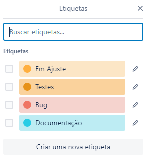

# Metodologia

A metodologia contempla as definições de ferramentas utilizadas pela equipe tanto para a manutenção dos códigos e demais artefatos quanto para a organização do time na execução das tarefas do projeto.

## Relação de Ambientes de Trabalho

Os artefatos do projeto são desenvolvidos a partir de diversas plataformas e a relação dos ambientes com seu respectivo propósito é apresentada na tabela que se segue

Ambiente|Plataforma|Link de Acesso
|:--------|:----------:|:--------------:|
|Repositório|GitHub|[GitHub](https://github.com/ICEI-PUC-Minas-PMV-ADS/pmv-ads-2023-1-e2-proj-int-t6-projeto-controle-de-ponto) |
|Documentos do projeto|GitHubDocs|[GitHubDocs](https://github.com/ICEI-PUC-Minas-PMV-ADS/pmv-ads-2023-1-e2-proj-int-t6-projeto-controle-de-ponto) |
|Projeto de Interface e  Wireframes| Figma  |   |
|Gerenciamento do Projeto|Trello| [Trello](https://trello.com/b/cQ0pnoDd/controle-de-ponto-puc) |

## Controle de Versão

A ferramenta de controle de versão adotada no projeto foi o
[Git](https://git-scm.com/), sendo que o [Github](https://github.com)
foi utilizado para hospedagem do repositório.

O projeto segue a seguinte convenção para o nome de branches:

- `main`: versão estável já testada do software
- `unstable`: versão já testada do software, porém instável
- `testing`: versão em testes do software
- `dev`: versão de desenvolvimento do software

Quanto à gerência de issues, o projeto adota a seguinte convenção para
etiquetas:

- `documentation`: melhorias ou acréscimos à documentação
- `bug`: uma funcionalidade encontra-se com problemas
- `enhancement`: uma funcionalidade precisa ser melhorada
- `feature`: uma nova funcionalidade precisa ser introduzida

## Gerenciamento de Projeto

### Divisão de Papéis

A equipe utiliza metodologias ágeis, tendo escolhido o Scrum como base para definição do processo de desenvolvimento.
A equipe está organizada da seguinte maneira:
- Scrum Master: Júnia Marina Campos
- Product Owner: Jeosafa Boy Eller
- Equipe de Desenvolvimento
Ana Carolina Mozelli
Anna Clara Rocha Mota
Gustavo Silva Diniz
- Equipe de Design
 Gustavo Silva Diniz

### Processo
Para organização e distribuição das tarefas do projeto, a equipe está utilizando o Trello estruturado com as seguintes listas:
- Recursos: esta lista mantém template de tarefas recorrentes com as configurações padronizadas que todos devem seguir. O objetivo é permitir a cópia destes
templates para agilizar a criação de novos cartões.
-  Etapas Projeto: recebe a lista de tarefas a serem feitas e entregues.
-  To Do: esta lista representa o que precisa ser feito naquela etapa do projeto, representa a Sprint Backlog.
-  In Progress: esta lista representa o que está sendo feito naquele momento.
-  Done: esta lista representa as etapas do projeto que já estão prontas para serem entregues

As tarefas seguem um esquema de etiquetagem, que pode ser visto na figura a seguir (com possibilidades de acrescentr mais etiquetas ao longo do projeto):

### Ferramentas

As ferramentas empregadas no projeto são:

- Editor de código: GitHub
- Ferramentas de comunicação: Teams e WhatsApp
- Ferramenta para criação de diagramas: LucidApp, Astah e Diagrams
- Ferramentas de desenho de tela (_wireframing_): Figma
