# Projeto de Interface

Pré-requisitos: <a href="2-Especificação do Projeto.md"> Documentação de Especificação</a>

A montagem da interface do sistema foi cuidadosamente desenvolvida para proporcionar maior conforto ao usuário, para isso estamos estabelecendo foco em acessibilidade, usabilidade e agilidade, todas as telas são projetadas para funcionamento em desktops.

## Diagrama de Fluxo

Conforme pode ser visto, a *Figura 5* mostra o diagrama de fluxo de interação do usuário pelas telas do sistema. Cada uma das telas deste fluxo é detalhada na seção de Wireframes que será desenvolvido. 

|FLUXO DO USUÁRIO| DESCRIÇÃO | RF |
|--|-------------------------------------------------------|-------------------------------|
|Home Page/Login/Recupere sua Senha | O usuário tem na página inicial um breve texto mostrando para que serve o sistema e em seguida ele faz seu login na página de Acesso a Sua Conta. Caso ele tenha esquecido sua senha, é redirecionado para a página de recuperação de senha. | RF-001 |
|Página Gestor | O gestor tem acesso ao menu com as funcionalidades "Configurações", "Controle de Ponto", "Relatório" e "Solicitações"|  |
|Página Gerenciamento Pessoais Funcionários|  Nas páginas de gerenciamento do funcionário, o gestor consegue incluir um novo colaborador, excluir ou editar informações do funcionário. Para isso, ele tem as telas de cadastro de usuário, cadastro de turno e cadastro de departamento, por exemplo. | RF-007 |
|Página Gerenciamento Ponto do Funcionário| Nas páginas referente ao gerenciamento do ponto do funcionário, o gestor consegue aprovar ou desaprovar todas as modificações solicitadas pelos colaboradores, além de visualizar o ponto de cada funcionário.  | RF-006 |
|Página Gerar Relatorios | Na página de gerar relatório, o Gestor consiguirá emitir um relatório consolidado com o ponto de cada colaborador para poder enviar a contabilidade no período estabelecido.  | RF-008|
|Página Funcionário | Na página do funcionário, ele consiguirá ver o saldo do banco de horas e registrar a jornada de trabalho do dia. Também visualizará um menu com as opções: "Meu ponto", "Justificar" e "Solicitações". | RF-002 |
|Página Gerenciar Ponto| Nas páginas relacionadas ao gerenciamento do ponto, o funcionário poderá pedir ajustes, visualizar suas marcações pendentes e aprovadas | RF-003 e RF-005 |
|Página Gerenciar Justificativas | Nas páginas relacionadas ao gerenciamento de justificativas, o funcionário poderá justificar uma ausencia de marcação da jornada de trabalho e, caso seja necessário, anexar documentos. | RF-003 e RF-004|

  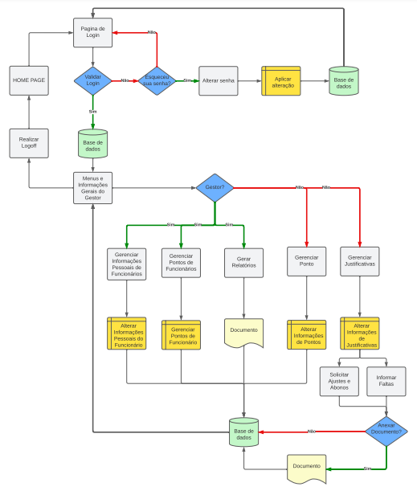

## Wireframes

Conforme fluxo de telas do projeto amostrado no item anterior, as telas do sistema são apresentadas em detalhes nos itens que se seguem. Todas essas telas têm uma estrutura comum que é apresentada na *Figura 6*. Nesta estrutura existem 3 grandes blocos, descritos a seguir. São eles:
- **Cabeçalho** - local onde são dispostos elementos fixos de identidade (logo) e icone de usuário;   
- **Conteúdo** - apresenta o conteúdo da tela em questão;   
- **Menu lateral** - apresenta o menu da aplicação que permite navegar pelas páginas.
- **Rodapé** - apresenta detalhes adicionais sobre o projeto e um mapa do site.

 

## Tela - Home Page
A tela inicial permite visualizar um texto padrão apresentando o sistema para o usuário:

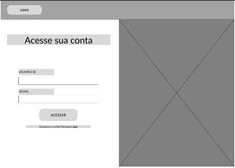

Figura Home Page

## Tela - Login e Recuperação de Senha
O modal que se abre ao clicar no botão acessar da página Home Page, permite o usuário preencher suas credenciais conforme orientado. Além disso, o usuário pode ser direcionado para redefinir a senha da conta na opção "Esqueceu sua senha?". O modal em questão pode ser visualizado conforme figuras abaixo:

Figura Login

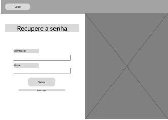

Figura Recupere sua Senha

## Tela - Cadastro de Usuário 
A tela a seguir permite que o Gestor cadastre um novo funcionáio ao banco de dados do sistema:

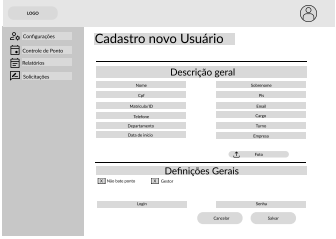

Figura Cadastro de Usuário

## Tela - Cadastro Turno
A tela a seguir permite que o Gestor cadastre um novo truno para associar a jornada de trabalho de cada colaborador.

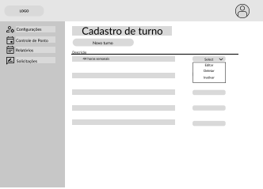

Figura Cadastro Turno

## Tela - Cadastro de Cargo
A tela a seguir permite que o Gestor cadastre um novo cargo para associar ao colaborador.

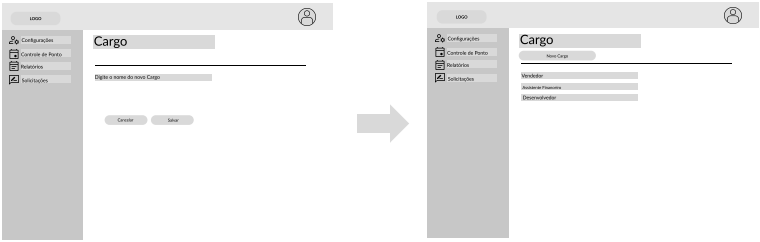

Figura Cadastro Cargo

## Tela – Cadastro Departamento 
A tela a seguir permite que o Gestor cadastre um novo departamento para associar ao colaborador.

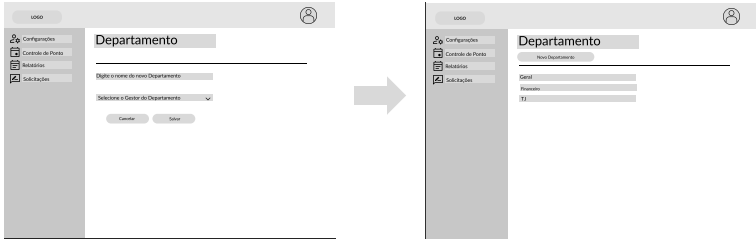

Figura Cadastro Departamento

## Tela – Colaboradores
A tela a seguir permite o Gestor visualizar e gerenciar os colaboradores que estão vinculados ao sistema:

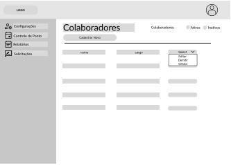

Figura Colaboradores

## Tela – Configurações Gerais
A tela a seguir permite que o Gestor Configure outras informações referentes aos funcionários:

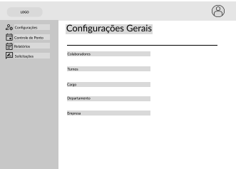

Figura Configurações Gerais

## Tela – Controle de Ponto  
A tela a seguir permite que o gestor gerencie o Ponto de cada funcionário relacionado a ele:

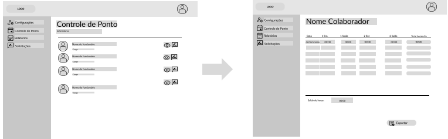

Figura Controle Ponto

## Tela – Relatórios
A tela a seguir permite que o Gestor emita um relatório de fechamento de ponto para envio a contabilidade.

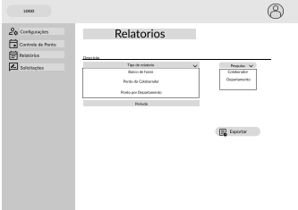

Figura Relatórios

## Tela – Solicitações Gestor
A tela a seguir permite que o Gestor aceite ou recuse uma solicitação feita pelo colaborador vinculado a ele.

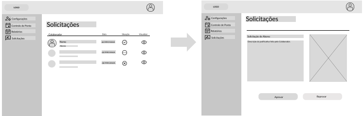

Figura Solicitação Gestor
 
## Tela – Ponto Colaborador
As telas a seguir permite que o Colaborador registre sua jornada de trabalho, visualiza seu banco de horas e visualize todos os registros ja feito por ele em um determinado periodo:

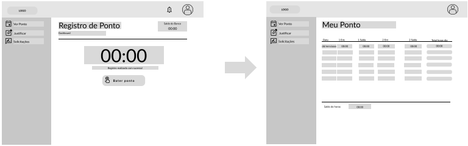

Figura Ponto Colaborador

## Tela – Solicitações Colaborador
A tela a seguir permite que o Colaborador faça solicitações de ajuste ao ponto e justificativas quando há falta ou não registro do ponto:

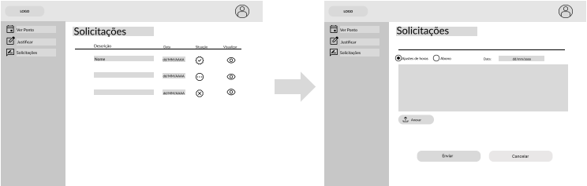

Figura Solicitações Colaborador

