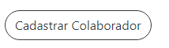
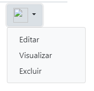
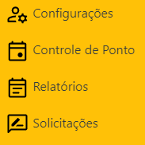

# Template Padrão da Aplicação

Pré-requisitos: <a href="2-Especificação do Projeto.md"> Especificação do Projeto</a>, <a href="3-Projeto de Interface.md"> Projeto de Interface</a>, <a href="4-Metodologia.md"> Metodologia</a>

Layout padrão da aplicação que será utilizado em todas as páginas com a definição de identidade visual, aspectos de responsividade e iconografia.

### Paleta de Cores

A paleta de cores conta com 3 cores padroes do Bootstrap utilizado na realização do projeto.

Para o menu lateral foi escolhida uma cor que chama atenção. Para Contraste, para o cabeçalho foi escolhido a cor preta e para manter a harmonia, a cor branca na parte do Conteúdo que aparecerá na tela. A seguir, as cores usadas na aplicação:

Cor Menu Lateral

Cor Cabeçalho

### Tipografia

A fonte utilizada na aplicação é a Lato, com tamanho 400 no cabeçalho e 700 nos titulos, também definidas por Bootstrap utilizado para o desenvolvimento da aplicação.

### Componentes

Os principais componentes personalizados que utilizamos,foram os botões para cadastrar novos funcionários/empresa/ponto/justificativa e o dropdaw para mostrar as ações que cada usuário pode fazer na página Index que ele estiver.

 : Exemplo de um botão de cadastro
 
 

 : Exemplo de um botão DropDow

### Ícones

