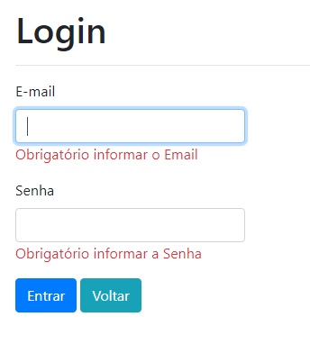
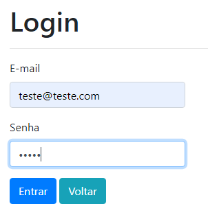
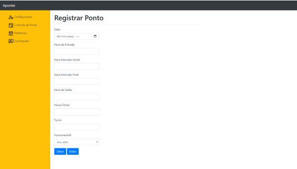
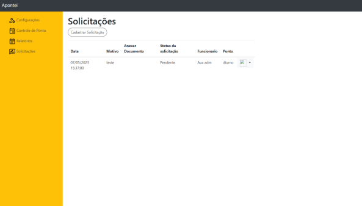
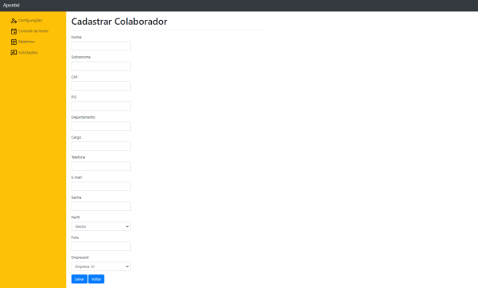
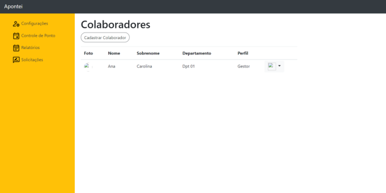
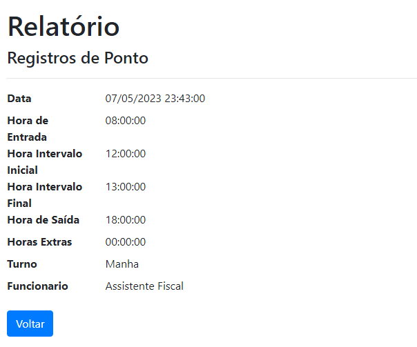

# Registro de Testes de Software

## CT 01 - Logar no Sistema

## CT 01 - Registrar o ponto

## CT 01 - Justificar registro de ponto incorreto, falta e solicitar abono

## CT 01 - Visualizar Registro de Ponto

## CT 01 - Aprovar/Reprovar ajustes

## CT 01 - Gerenciar Funcionários

## CT 01 - Emitir Relatórios

